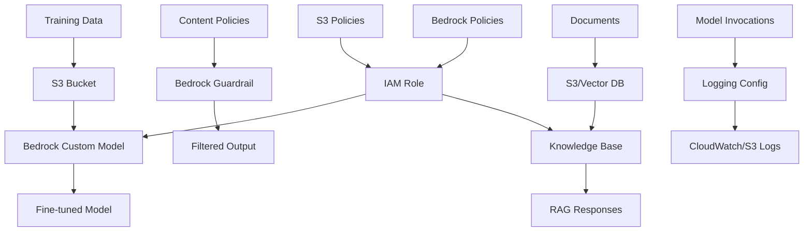

# AWS Bedrock Terraform Module

A comprehensive Terraform module for creating and configuring AWS Bedrock resources including Custom Models, Guardrails, Knowledge Bases, and Logging Configurations with automatic IAM role management, S3 integration, and enterprise-ready configurations.

## Features

- ✅ **Custom Models**: Fine-tune foundation models for specific use cases
- 🛡️ **Guardrails**: Content filtering and safety controls for AI applications
- 📚 **Knowledge Bases**: RAG (Retrieval-Augmented Generation) with vector storage
- 📊 **Logging Configuration**: Comprehensive logging for model invocations
- 🔐 **IAM Management**: Automatic role creation with least-privilege permissions
- 📁 **S3 Integration**: Seamless integration with S3 for training data and artifacts
- 🎯 **Flexible Configuration**: Support for both new and existing IAM roles
- 🔒 **Security Best Practices**: Server-side encryption requirements and secure policies
- 🏷️ **Resource Tagging**: Consistent resource organization and cost tracking
- ⚡ **Production Ready**: Lifecycle management and dependency handling

## Architecture



## Prerequisites

- Terraform >= 1.5.0
- AWS Provider >= 5.0
- Existing S3 bucket for training data and model artifacts (for custom models)
- Valid IAM permissions for Bedrock service
- Bedrock access enabled in your AWS account
- Vector database (OpenSearch, Pinecone, or RDS) for knowledge bases (if applicable)

## Quick Start

### Custom Model

```hcl
module "custom_model" {
  source = "./modules/bedrock"

  # Resource Configuration
  name                 = "my-custom-model"
  resource_type        = "custom_model"
  base_model_identifier = "amazon.titan-text-express-v1"
  s3_bucket_name       = "my-bedrock-training-data"
  
  # Training Data
  training_data_config = {
    s3_uri = "s3://my-bedrock-training-data/training/dataset.jsonl"
  }
  
  validation_data_config = {
    s3_uri = "s3://my-bedrock-training-data/validation/validation.jsonl"
  }
  
  output_data_config = {
    s3_uri = "s3://my-bedrock-training-data/models/"
  }
  
  # Hyperparameters
  hyperparameters = {
    epochCount              = "10"
    batchSize               = "8"
    learningRate            = "0.00001"
    learningRateWarmupSteps = "100"
  }
  
  tags = {
    Environment = "production"
    UseCase     = "custom-chatbot"
  }
}
```

### Guardrail

```hcl
module "content_guardrail" {
  source = "./modules/bedrock"

  name          = "content-safety-guardrail"
  resource_type = "guardrail"
  
  blocked_input_messaging  = "Your request contains content that violates our policies."
  blocked_outputs_messaging = "The response contains content that cannot be displayed."
  
  content_policy_config = {
    filters_config = [
      {
        input_strength  = "HIGH"
        output_strength = "HIGH"
        type            = "HATE"
      },
      {
        input_strength  = "MEDIUM"
        output_strength = "MEDIUM"
        type            = "MISCONDUCT"
      }
    ]
  }
  
  word_policy_config = {
    words_config = [
      { text = "blocked-word-1" },
      { text = "blocked-word-2" }
    ]
  }
  
  sensitive_information_policy_config = {
    pii_entities_config = [
      {
        action = "BLOCK"
        type   = "EMAIL"
      },
      {
        action = "ANONYMIZE"
        type   = "SSN"
      }
    ]
  }
  
  tags = {
    Environment = "production"
    UseCase     = "content-filtering"
  }
}
```

### Knowledge Base with S3 Data Source

```hcl
module "knowledge_base" {
  source = "./modules/bedrock"

  name          = "company-knowledge-base"
  resource_type = "knowledge_base"
  
  knowledge_base_name = "company-docs-kb"
  description         = "Knowledge base for company documentation"
  
  storage_configuration = {
    type = "OPENSEARCH_SERVERLESS"
    opensearch_serverless_configuration = {
      collection_arn = "arn:aws:aoss:us-east-1:123456789012:collection/abc123"
      field_mapping = {
        vector_field   = "vector"
        metadata_field = "metadata"
        text_field     = "text"
      }
    }
  }
  
  data_source = {
    name        = "s3-documents"
    description = "Company documents from S3"
    data_source_configuration = {
      type = "S3"
      s3_configuration = {
        bucket_arn = "arn:aws:s3:::company-documents"
        inclusion_prefixes = ["documents/", "manuals/"]
      }
    }
    vector_ingestion_configuration = {
      chunking_configuration = {
        chunking_strategy = "FIXED_SIZE"
        fixed_size_chunking_configuration = {
          max_tokens         = 300
          overlap_percentage = 20
        }
      }
    }
  }
  
  tags = {
    Environment = "production"
    UseCase     = "rag-application"
  }
}
```

### Logging Configuration

```hcl
module "bedrock_logging" {
  source = "./modules/bedrock"

  name          = "bedrock-invocation-logging"
  resource_type = "logging_config"
  
  logging_config = {
    text_data_delivery_enabled     = true
    image_data_delivery_enabled    = false
    embedding_data_delivery_enabled = true
    
    s3_config = {
      bucket_name = "bedrock-logs"
      key_prefix  = "invocations/"
    }
    
    cloudwatch_config = {
      log_group_name = "/aws/bedrock/invocations"
      large_data_delivery_s3_config = {
        bucket_name = "bedrock-logs-large"
        key_prefix  = "large-data/"
      }
    }
  }
}
```

## Input Variables

### Required Variables

| Variable | Type | Description |
|----------|------|-------------|
| `name` | `string` | Name for the Bedrock resource |
| `resource_type` | `string` | Type of resource: `custom_model`, `guardrail`, `knowledge_base`, or `logging_config` |

### Optional Variables

#### General Configuration

| Variable | Type | Default | Description |
|----------|------|---------|-------------|
| `existing_role_arn` | `string` | `null` | Use existing IAM role instead of creating new |
| `s3_bucket_name` | `string` | `null` | S3 bucket name for training data and artifacts |
| `s3_key_prefix` | `string` | `""` | S3 key prefix for organizing data |
| `tags` | `map(string)` | `{}` | Resource tags |
| `kms_key_id` | `string` | `null` | KMS key ID for encryption |

#### Custom Model Configuration (when `resource_type = "custom_model"`)

| Variable | Type | Default | Description |
|----------|------|---------|-------------|
| `base_model_identifier` | `string` | `null` | Base model identifier (e.g., `amazon.titan-text-express-v1`) |
| `training_data_config` | `object` | `null` | Training data configuration with `s3_uri` |
| `validation_data_config` | `object` | `null` | Validation data configuration with `s3_uri` |
| `output_data_config` | `object` | `null` | Output data configuration with `s3_uri` |
| `hyperparameters` | `map(string)` | `{}` | Hyperparameters for model training |

#### Guardrail Configuration (when `resource_type = "guardrail"`)

| Variable | Type | Default | Description |
|----------|------|---------|-------------|
| `blocked_input_messaging` | `string` | `"Your request contains content that is not allowed."` | Message for blocked input |
| `blocked_outputs_messaging` | `string` | `"The response contains content that is not allowed."` | Message for blocked output |
| `content_policy_config` | `object` | `null` | Content policy configuration |
| `word_policy_config` | `object` | `null` | Word policy configuration |
| `topic_policy_config` | `object` | `null` | Topic policy configuration |
| `sensitive_information_policy_config` | `object` | `null` | PII/regex policy configuration |

#### Knowledge Base Configuration (when `resource_type = "knowledge_base"`)

| Variable | Type | Default | Description |
|----------|------|---------|-------------|
| `knowledge_base_name` | `string` | `null` | Name of the knowledge base (defaults to `name`) |
| `description` | `string` | `""` | Description of the knowledge base |
| `role_arn` | `string` | `null` | IAM role ARN (overrides `existing_role_arn`) |
| `storage_configuration` | `object` | `null` | Vector storage configuration (OpenSearch, Pinecone, or RDS) |
| `data_source` | `object` | `null` | Data source configuration for the knowledge base |

#### Logging Configuration (when `resource_type = "logging_config"`)

| Variable | Type | Default | Description |
|----------|------|---------|-------------|
| `logging_config` | `object` | `null` | Logging configuration for model invocations |

## Outputs

| Output | Description |
|--------|-------------|
| `custom_model_id` | ID of the custom model (if created) |
| `custom_model_arn` | ARN of the custom model (if created) |
| `custom_model_name` | Name of the custom model (if created) |
| `guardrail_id` | ID of the guardrail (if created) |
| `guardrail_arn` | ARN of the guardrail (if created) |
| `knowledge_base_id` | ID of the knowledge base (if created) |
| `knowledge_base_arn` | ARN of the knowledge base (if created) |
| `data_source_id` | ID of the knowledge base data source (if created) |
| `iam_role_arn` | ARN of the IAM role used by Bedrock |
| `iam_role_name` | Name of the IAM role created (if created by module) |

## Usage Examples

### Advanced Custom Model with Validation

```hcl
module "advanced_custom_model" {
  source = "./modules/bedrock"

  name                 = "advanced-sentiment-model"
  resource_type        = "custom_model"
  base_model_identifier = "amazon.titan-text-express-v1"
  s3_bucket_name       = "ml-training-bucket"
  
  training_data_config = {
    s3_uri = "s3://ml-training-bucket/training/sentiment-data.jsonl"
  }
  
  validation_data_config = {
    s3_uri = "s3://ml-training-bucket/validation/sentiment-validation.jsonl"
  }
  
  output_data_config = {
    s3_uri = "s3://ml-training-bucket/models/sentiment/"
  }
  
  hyperparameters = {
    epochCount              = "15"
    batchSize               = "16"
    learningRate            = "0.00005"
    learningRateWarmupSteps = "200"
  }
  
  tags = {
    Environment = "production"
    Team        = "ml-engineering"
    UseCase     = "sentiment-analysis"
  }
}
```

### Comprehensive Guardrail with Multiple Policies

```hcl
module "comprehensive_guardrail" {
  source = "./modules/bedrock"

  name          = "enterprise-guardrail"
  resource_type = "guardrail"
  
  content_policy_config = {
    filters_config = [
      {
        input_strength  = "HIGH"
        output_strength = "HIGH"
        type            = "HATE"
      },
      {
        input_strength  = "MEDIUM"
        output_strength = "MEDIUM"
        type            = "MISCONDUCT"
      },
      {
        input_strength  = "LOW"
        output_strength = "LOW"
        type            = "PROMPT_ATTACK"
      }
    ]
  }
  
  word_policy_config = {
    words_config = [
      { text = "confidential-term-1" },
      { text = "confidential-term-2" }
    ]
    managed_word_lists_config = [
      { type = "PROFANITY" }
    ]
  }
  
  topic_policy_config = {
    topics_config = [
      {
        name       = "Financial Information"
        definition = "Topics related to financial data, transactions, and banking"
        examples   = ["account balance", "credit card", "transaction"]
        type       = "DENY"
      }
    ]
  }
  
  sensitive_information_policy_config = {
    pii_entities_config = [
      { action = "BLOCK", type = "EMAIL" },
      { action = "BLOCK", type = "PHONE" },
      { action = "ANONYMIZE", type = "SSN" },
      { action = "ANONYMIZE", type = "CREDIT_DEBIT_NUMBER" }
    ]
    regexes_config = [
      {
        action      = "BLOCK"
        description = "Block internal project codes"
        name        = "Project Code Pattern"
        pattern     = "PROJ-[0-9]{4}"
      }
    ]
  }
  
  tags = {
    Environment = "production"
    UseCase     = "enterprise-safety"
  }
}
```

### Knowledge Base with RDS Vector Storage

```hcl
module "rds_knowledge_base" {
  source = "./modules/bedrock"

  name          = "rds-knowledge-base"
  resource_type = "knowledge_base"
  
  knowledge_base_name = "product-docs-kb"
  description         = "Product documentation knowledge base"
  
  storage_configuration = {
    type = "RDS"
    rds_configuration = {
      credentials_secret_arn = "arn:aws:secretsmanager:us-east-1:123456789012:secret:rds-credentials"
      database_name          = "vector_db"
      resource_arn           = "arn:aws:rds:us-east-1:123456789012:cluster:vector-cluster"
      table_name             = "embeddings"
      field_mapping = {
        vector_field     = "embedding"
        metadata_field   = "metadata"
        primary_key_field = "id"
        text_field       = "text"
      }
    }
  }
  
  data_source = {
    name        = "product-docs-s3"
    description = "Product documentation from S3"
    data_source_configuration = {
      type = "S3"
      s3_configuration = {
        bucket_arn         = "arn:aws:s3:::product-documentation"
        inclusion_prefixes = ["docs/", "api/", "guides/"]
      }
    }
    vector_ingestion_configuration = {
      chunking_configuration = {
        chunking_strategy = "FIXED_SIZE"
        fixed_size_chunking_configuration = {
          max_tokens         = 500
          overlap_percentage = 25
        }
      }
    }
  }
  
  tags = {
    Environment = "production"
    UseCase     = "product-support"
  }
}
```

## Security Best Practices

### IAM Roles and Policies

The module automatically creates IAM roles with least-privilege permissions:

- **S3 Access**: Read access to training data buckets, write access to output buckets
- **Bedrock Service**: Permissions to create and manage Bedrock resources
- **Encryption**: Enforces server-side encryption (AES256) for S3 operations

### Data Protection

- **Encryption at Rest**: Support for KMS encryption keys
- **Encryption in Transit**: All data transmission uses TLS/SSL
- **S3 Server-Side Encryption**: Required for all S3 operations

### Guardrails

- **Content Filtering**: Multi-level content policy enforcement
- **PII Protection**: Automatic detection and handling of sensitive information
- **Custom Word Lists**: Block or allow specific terms
- **Topic Filtering**: Deny or allow specific topics

## Cost Considerations

### Custom Models
- **Training**: Pay per training job (varies by model and data size)
- **Inference**: Pay per token for model invocations
- **Storage**: S3 storage costs for model artifacts

### Knowledge Bases
- **Embedding**: Cost per token for embedding generation
- **Vector Storage**: Costs depend on storage backend (OpenSearch, Pinecone, RDS)
- **Data Ingestion**: One-time cost per document ingestion

### Guardrails
- **No Additional Cost**: Guardrails are included with Bedrock usage

### Logging
- **S3 Storage**: Standard S3 storage and request costs
- **CloudWatch**: Standard CloudWatch Logs pricing

### Cost Optimization Tips
- 🏷️ Use consistent tagging for cost allocation
- 📊 Monitor usage with CloudWatch metrics
- 🔄 Implement lifecycle policies for temporary data
- 📈 Start with smaller models and scale up
- 🎯 Use batch processing for large datasets

## Troubleshooting

### Common Issues

#### Custom Model Training Fails
- **Issue**: Training job fails with permission errors
- **Solution**: Verify IAM role has proper S3 and Bedrock permissions
- **Check**: Ensure training data is in correct format (JSONL)

#### Knowledge Base Ingestion Errors
- **Issue**: Documents not being ingested
- **Solution**: Verify S3 bucket permissions and data source configuration
- **Check**: Ensure vector database is properly configured and accessible

#### Guardrail Not Blocking Content
- **Issue**: Guardrail not filtering expected content
- **Solution**: Review filter strength settings and policy configurations
- **Check**: Verify guardrail is attached to model invocations

## Related Resources

- [AWS Bedrock Documentation](https://docs.aws.amazon.com/bedrock/)
- [Bedrock Custom Models Guide](https://docs.aws.amazon.com/bedrock/latest/userguide/custom-models.html)
- [Bedrock Guardrails Guide](https://docs.aws.amazon.com/bedrock/latest/userguide/guardrails.html)
- [Bedrock Knowledge Bases Guide](https://docs.aws.amazon.com/bedrock/latest/userguide/knowledge-base.html)
- [Terraform AWS Provider - Bedrock](https://registry.terraform.io/providers/hashicorp/aws/latest/docs/resources/bedrock_custom_model)

---

**Version**: 1.0.0  
**Last Updated**: 2025  
**Terraform Version**: >= 1.5.0  
**AWS Provider Version**: >= 5.0

