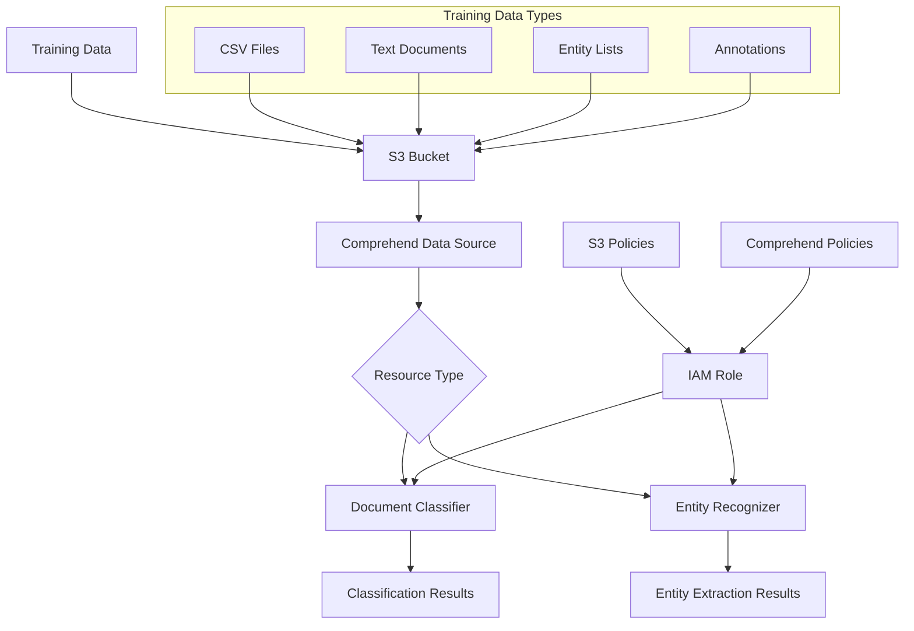

# AWS Comprehend Terraform Module

A comprehensive Terraform module for creating and configuring AWS Comprehend machine learning models including Document Classifiers and Entity Recognizers with automatic IAM role management, S3 integration, and enterprise-ready configurations.

## Features

- ✅ **Document Classification**: Deploy custom text classifiers for document categorization
- 🏷️ **Entity Recognition**: Extract custom entities from text with high accuracy
- 🔐 **IAM Management**: Automatic role creation with least-privilege permissions
- 📁 **S3 Integration**: Seamless integration with S3 for training data and results
- 🎯 **Flexible Configuration**: Support for both new and existing IAM roles
- 🔒 **Security Best Practices**: Server-side encryption requirements and secure policies
- 🏷️ **Resource Tagging**: Consistent resource organization and cost tracking
- ⚡ **Production Ready**: Lifecycle management and dependency handling

## Architecture



## Prerequisites

- Terraform >= 1.5.0
- AWS Provider >= 5.0
- Existing S3 bucket with training data
- Valid IAM permissions for Comprehend service
- Training data in correct format (CSV for classifiers, entity lists/annotations for recognizers)

## Quick Start

### Document Classifier

```hcl
module "document_classifier" {
  source = "./modules/comprehend"

  # Resource Configuration
  name             = "product-review-classifier"
  resource_type    = "classifier"
  s3_bucket_name   = "my-comprehend-training-data"
  
  # Training Data
  input_s3_uri     = "s3://my-comprehend-training-data/classifier/reviews.csv"
  output_s3_uri    = "s3://my-comprehend-training-data/results/"
  
  # Optional Configuration
  language_code    = "en"
  
  tags = {
    Environment = "production"
    UseCase     = "sentiment-analysis"
  }
}
```

### Entity Recognizer

```hcl
module "entity_recognizer" {
  source = "./modules/comprehend"

  # Resource Configuration
  name             = "legal-document-entities"
  resource_type    = "recognizer"
  s3_bucket_name   = "my-comprehend-training-data"
  
  # Entity Configuration
  entity_types        = ["PERSON", "ORGANIZATION", "CONTRACT_ID"]
  documents_s3_uri    = "s3://my-comprehend-training-data/documents/"
  annotations_s3_uri  = "s3://my-comprehend-training-data/annotations.csv"
  
  tags = {
    Environment = "production"
    UseCase     = "legal-processing"
  }
}
```

## Module Structure

```
.
├── main.tf              # Main Comprehend resources
├── iam.tf              # IAM roles and policies
├── variables.tf        # Input variables
├── outputs.tf         # Output values
├── versions.tf        # Provider requirements
├── examples/
│   ├── classifier-basic/
│   ├── recognizer-advanced/
│   └── existing-iam-role/
└── README.md
```

## Variables Reference

### Required Variables

| Variable | Type | Description | Example |
|----------|------|-------------|---------|
| `name` | `string` | Name for the Comprehend resource | `"product-classifier"` |
| `resource_type` | `string` | Type of resource: `classifier` or `recognizer` | `"classifier"` |
| `s3_bucket_name` | `string` | S3 bucket name for training data | `"my-training-data"` |

### Optional Variables

#### General Configuration

| Variable | Type | Default | Description |
|----------|------|---------|-------------|
| `language_code` | `string` | `"en"` | Language code (en, es, fr, etc.) |
| `existing_role_arn` | `string` | `null` | Use existing IAM role instead of creating new |
| `s3_key_prefix` | `string` | `""` | S3 key prefix for organizing data |
| `tags` | `map(string)` | `{}` | Resource tags |

#### Classifier Configuration (when `resource_type = "classifier"`)

| Variable | Type | Default | Description |
|----------|------|---------|-------------|
| `input_s3_uri` | `string` | `null` | S3 URI for training data (CSV format) |
| `output_s3_uri` | `string` | `null` | S3 URI for output results |

#### Entity Recognizer Configuration (when `resource_type = "recognizer"`)

| Variable | Type | Default | Description |
|----------|------|---------|-------------|
| `entity_types` | `list(string)` | `[]` | List of entity types to recognize |
| `documents_s3_uri` | `string` | `null` | S3 URI for training documents |
| `entities_s3_uri` | `string` | `null` | S3 URI for entity list (alternative to annotations) |
| `annotations_s3_uri` | `string` | `null` | S3 URI for annotations file (alternative to entity list) |

## Usage Examples

### Basic Document Classifier

```hcl
module "sentiment_classifier" {
  source = "./modules/comprehend"

  # Basic Configuration
  name             = "product-sentiment-classifier"
  resource_type    = "classifier"
  s3_bucket_name   = "company-ml-data"
  
  # Training Data (CSV with text and label columns)
  input_s3_uri     = "s3://company-ml-data/training/product-reviews.csv"
  output_s3_uri    = "s3://company-ml-data/models/sentiment/"
  
  language_code    = "en"
  
  tags = {
    Environment = "production"
    Team        = "data-science"
    UseCase     = "customer-feedback"
  }
}
```

### Advanced Entity Recognizer with Annotations

```hcl
module "medical_entity_recognizer" {
  source = "./modules/comprehend"

  # Advanced Configuration
  name             = "medical-records-entities"
  resource_type    = "recognizer"
  s3_bucket_name   = "medical-ai-training"
  s3_key_prefix    = "medical-nlp"
  
  # Entity Types
  entity_types = [
    "MEDICATION",
    "MEDICAL_CONDITION", 
    "DOSAGE",
    "DOCTOR_NAME",
    "PATIENT_ID"
  ]
  
  # Training Data
  documents_s3_uri   = "s3://medical-ai-training/medical-nlp/documents/"
  annotations_s3_uri = "s3://medical-ai-training/medical-nlp/annotations.csv"
  
  language_code = "en"
  
  tags = {
    Environment     = "production"
    Department      = "healthcare"
    DataClass       = "phi-protected"
    ComplianceLevel = "hipaa"
  }
}
```

### Using Existing IAM Role

```hcl
# First, create your custom IAM role
resource "aws_iam_role" "custom_comprehend_role" {
  name = "custom-comprehend-execution-role"

  assume_role_policy = jsonencode({
    Version = "2012-10-17"
    Statement = [
      {
        Action = "sts:AssumeRole"
        Effect = "Allow"
        Principal = {
          Service = "comprehend.amazonaws.com"
        }
      }
    ]
  })
}

# Add your custom policies...

module "classifier_with_custom_role" {
  source = "./modules/comprehend"

  name               = "custom-role-classifier" 
  resource_type      = "classifier"
  existing_role_arn  = aws_iam_role.custom_comprehend_role.arn
  
  # S3 configuration still needed for policy validation
  s3_bucket_name     = "my-training-bucket"
  input_s3_uri       = "s3://my-training-bucket/data.csv"
  
  tags = {
    Environment = "development"
    CustomRole  = "true"
  }
}
```

### Entity Recognizer with Entity List (Alternative to Annotations)

```hcl
module "finance_entity_recognizer" {
  source = "./modules/comprehend"

  name             = "financial-document-entities"
  resource_type    = "recognizer"
  s3_bucket_name   = "finance-ml-data"
  
  # Entity Configuration
  entity_types = [
    "ACCOUNT_NUMBER",
    "ROUTING_NUMBER", 
    "INSTITUTION_NAME",
    "TRANSACTION_ID"
  ]
  
  # Using entity list instead of annotations
  documents_s3_uri = "s3://finance-ml-data/documents/"
  entities_s3_uri  = "s3://finance-ml-data/entity-list.csv"  # Not annotations
  
  tags = {
    Environment = "production"
    Domain      = "financial-services"
    Sensitive   = "true"
  }
}
```

### Multi-Language Support

```hcl
module "spanish_classifier" {
  source = "./modules/comprehend"

  name             = "spanish-news-classifier"
  resource_type    = "classifier"
  s3_bucket_name   = "multilingual-training-data"
  
  input_s3_uri     = "s3://multilingual-training-data/spanish/news-articles.csv"
  output_s3_uri    = "s3://multilingual-training-data/models/spanish/"
  
  language_code    = "es"  # Spanish
  
  tags = {
    Environment = "production"
    Language    = "spanish"
    Region      = "latam"
  }
}
```

## Training Data Formats

### Document Classifier Training Data (CSV)

Your CSV file should have two columns:
```csv
text,label
"This product is amazing! Great quality and fast shipping.","POSITIVE"
"Poor customer service and defective item.","NEGATIVE"
"The item was okay, nothing special.","NEUTRAL"
```

**Requirements:**
- UTF-8 encoding
- Header row with column names
- Minimum 10 examples per label
- Maximum 1 million examples total
- Text column: up to 5000 UTF-8 characters

### Entity Recognizer Annotations (CSV)

```csv
File,Line,Begin Offset,End Offset,Type
document1.txt,0,0,12,PERSON
document1.txt,0,25,45,ORGANIZATION
document2.txt,1,15,25,LOCATION
```

**Requirements:**
- Annotations reference text files in documents folder
- Offset positions must be accurate
- Entity types must match those specified in `entity_types`

### Entity List Format (CSV)

```csv
Text,Type
John Smith,PERSON
Microsoft Corporation,ORGANIZATION
New York City,LOCATION
```

## Validation Rules

The module includes comprehensive validation:

### Resource Type Validation
```hcl
validation {
  condition     = contains(["classifier", "recognizer"], var.resource_type)
  error_message = "Resource type must be either 'classifier' or 'recognizer'."
}
```

### Classifier Configuration Validation
- `input_s3_uri` required when `resource_type = "classifier"`
- S3 URIs must be valid format

### Entity Recognizer Validation
- `entity_types` cannot be empty for recognizer
- `documents_s3_uri` required for recognizer
- Either `entities_s3_uri` OR `annotations_s3_uri` required (not both)

## Outputs

| Output | Type | Description |
|--------|------|-------------|
| `classifier_id` | `string` | ID of the document classifier (if created) |
| `classifier_arn` | `string` | ARN of the document classifier (if created) |
| `recognizer_id` | `string` | ID of the entity recognizer (if created) |
| `recognizer_arn` | `string` | ARN of the entity recognizer (if created) |
| `iam_role_arn` | `string` | ARN of the IAM role used by Comprehend |
| `iam_role_name` | `string` | Name of the IAM role created (if created by module) |

## IAM Permissions

### Automatically Created IAM Role Permissions

#### S3 Permissions
```json
{
  "Version": "2012-10-17",
  "Statement": [
    {
      "Effect": "Allow",
      "Action": [
        "s3:GetObject",
        "s3:ListBucket"
      ],
      "Resource": [
        "arn:aws:s3:::your-bucket",
        "arn:aws:s3:::your-bucket/*"
      ]
    },
    {
      "Effect": "Allow", 
      "Action": [
        "s3:PutObject",
        "s3:PutObjectAcl"
      ],
      "Resource": ["arn:aws:s3:::your-bucket/*"],
      "Condition": {
        "StringEquals": {
          "s3:x-amz-server-side-encryption": "AES256"
        }
      }
    }
  ]
}
```

#### Comprehend Service Permissions
- Full Comprehend service access for model training and inference

### Required Terraform Execution Permissions

Your Terraform execution role needs:
```json
{
  "Version": "2012-10-17",
  "Statement": [
    {
      "Effect": "Allow",
      "Action": [
        "comprehend:*",
        "iam:CreateRole",
        "iam:DeleteRole",
        "iam:AttachRolePolicy", 
        "iam:DetachRolePolicy",
        "iam:CreatePolicy",
        "iam:DeletePolicy",
        "iam:PassRole",
        "iam:GetRole",
        "iam:GetPolicy"
      ],
      "Resource": "*"
    }
  ]
}
```

## Best Practices

### Training Data
- ✅ **Quality over Quantity**: Focus on high-quality, representative examples
- ✅ **Balanced Classes**: Ensure roughly equal examples per class for classifiers
- ✅ **Data Validation**: Validate UTF-8 encoding and format requirements
- ✅ **Version Control**: Keep training data versioned for reproducibility

### Security
- ✅ **S3 Encryption**: Enable server-side encryption on S3 buckets
- ✅ **Access Control**: Use least-privilege IAM policies
- ✅ **Data Classification**: Tag resources according to data sensitivity
- ⚠️ **Sensitive Data**: Avoid training on PII without proper safeguards

### Performance & Cost
- ✅ **Monitor Training**: Comprehend training can take 30+ minutes
- ✅ **Resource Naming**: Use descriptive names for easy identification
- ✅ **Lifecycle Management**: Clean up unused models to avoid charges
- ✅ **Testing**: Start with small datasets for initial validation

### Operational
- ✅ **Tagging Strategy**: Implement consistent tagging for cost tracking
- ✅ **Documentation**: Document entity types and classification schemas
- ✅ **Versioning**: Version your models for rollback capabilities
- ✅ **Monitoring**: Set up CloudWatch alerts for training job failures

## Troubleshooting

### Common Issues

**Training Job Failures**
```bash
# Check training job status
aws comprehend describe-document-classifier --document-classifier-arn <arn>
aws comprehend describe-entity-recognizer --entity-recognizer-arn <arn>

# Common causes:
# - Insufficient training data (< 10 examples per class)
# - Invalid CSV format or encoding
# - S3 permissions issues
# - Malformed annotations
```

**IAM Permission Errors**
```bash
# Verify IAM role can assume Comprehend service
aws sts assume-role --role-arn <role-arn> --role-session-name test

# Check S3 bucket permissions
aws s3 ls s3://your-bucket/path/ --profile comprehend-role
```

**Data Format Issues**
```bash
# Validate CSV format
head -n 5 your-training-data.csv

# Check encoding
file your-training-data.csv  # Should show UTF-8

# Validate annotations offsets
# Ensure Begin/End Offset positions are accurate in source documents
```

### Debug Commands

```bash
# Terraform debugging
terraform plan -target=module.comprehend.aws_comprehend_document_classifier.this
terraform apply -target=module.comprehend.aws_iam_role.comprehend_role

# AWS CLI validation
aws comprehend list-document-classifiers
aws comprehend list-entity-recognizers
aws comprehend describe-dominant-language-detection-job --job-id <job-id>
```

## Supported Languages

- **English (en)** - Full support for all features
- **Spanish (es)** - Document classification and entity recognition
- **French (fr)** - Document classification and entity recognition  
- **German (de)** - Document classification and entity recognition
- **Italian (it)** - Document classification and entity recognition
- **Portuguese (pt)** - Document classification and entity recognition
- **Arabic (ar)** - Document classification only
- **Hindi (hi)** - Document classification only
- **Japanese (ja)** - Document classification only
- **Korean (ko)** - Document classification only
- **Chinese (zh)** - Document classification only

## Supported File Types

### Training Data
- **CSV**: Primary format for training data
- **Text Files**: UTF-8 encoded plain text for entity recognizer documents

### Document Processing (Post-Training)
- **Text**: Plain text, UTF-8 encoded
- **PDF**: Extractable text (not scanned images)
- **Word Documents**: DOC, DOCX files
- **Web Content**: HTML pages (text extraction)

## Cost Considerations

### Training Costs
- **Document Classifier**: $3.00 per training job + $0.50 per hour of training time
- **Entity Recognizer**: $3.00 per training job + $0.50 per hour of training time
- **Typical Training Time**: 30 minutes to 4 hours depending on data size

### Inference Costs
- **Real-time**: $0.0005 per 100 characters (minimum 3 characters per request)
- **Batch**: $0.0001 per 100 characters
- **Custom Models**: Additional $0.50 per hour for custom model hosting

### Cost Optimization Tips
- 🏷️ Use consistent tagging for cost allocation
- 📊 Monitor usage with CloudWatch metrics  
- 🔄 Delete unused models to avoid hosting charges
- 📈 Use batch processing for large document sets
- 🎯 Start with smaller training datasets for initial validation

## Changelog

### Version 1.0.0 (Current)
- ✨ Initial release with Document Classifier and Entity Recognizer support
- 🔐 Automatic IAM role creation with security best practices  
- 🏷️ Comprehensive validation rules and error handling
- 📁 Full S3 integration for training data and results
- 🎯 Support for existing IAM role integration
- 🏷️ Enterprise-ready tagging and lifecycle management

### Roadmap
- 🔄 Support for model versioning and rollback
- 📊 CloudWatch dashboard integration
- 🔗 Multi-data source support
- 🌐 Additional language support
- 🔍 Enhanced monitoring and alerting

## Contributing

We welcome contributions! Please see our contributing guidelines:

1. **Fork** the repository
2. **Create** a feature branch (`git checkout -b feature/amazing-feature`)
3. **Follow** Terraform best practices and include tests
4. **Update** documentation for any new variables or outputs
5. **Submit** a Pull Request with a clear description

### Development Guidelines
- Follow HashiCorp Configuration Language (HCL) best practices
- Include validation rules for new variables
- Add examples for complex configurations  
- Test with both classifier and recognizer scenarios
- Update this README for any new features

### Testing
```bash
# Validate syntax
terraform validate

# Format code
terraform fmt -recursive

# Plan test configuration
cd examples/basic-classifier/
terraform init
terraform plan
```

---

**Version**: 1.0.0  
**Last Updated**: September 2025  
**Terraform Version**: >= 1.5.0  
**AWS Provider Version**: >= 5.0  

**License**: MIT  
**Maintainer**: DevOps Team  
**Support**: Create an issue in the repository for questions or bug reports