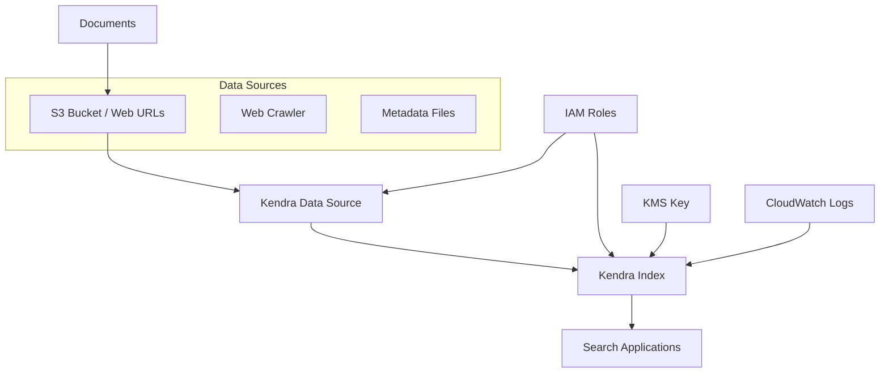

# AWS Kendra Terraform Module

A comprehensive Terraform module for creating and configuring AWS Kendra search indices and data sources with support for S3 and web crawler data sources, IAM roles, encryption, and metadata configuration.

## Features

- ✅ **Kendra Index Creation**: Deploy fully configured search indices
- 📁 **S3 Data Source**: Index documents from S3 buckets with ACL and metadata support
- 🕷️ **Web Crawler**: Crawl websites with authentication, proxy, and rate limiting
- 🔐 **IAM Management**: Automatic role creation with least-privilege permissions
- 🔒 **Encryption Support**: KMS encryption for data at rest
- 📊 **Metadata Configuration**: Custom document metadata fields and relevance tuning
- 👥 **User Token Support**: JWT-based access control integration
- 🏷️ **Resource Tagging**: Consistent resource organization

## Architecture



## Prerequisites

- Terraform >= 1.0
- AWS Provider >= 4.0
- Existing S3 bucket (for S3 data source)
- KMS key for encryption (optional)
- Valid IAM permissions for Kendra service

## Quick Start

```hcl
module "kendra_search" {
  source = "./path/to/this/module"

  # Index Configuration
  kendra_index_name        = "my-search-index"
  kendra_index_description = "Document search index"
  kendra_index_edition     = "DEVELOPER_EDITION"

  # S3 Data Source
  kendra_data_source_name = "documents-source"
  kendra_data_source_type = "S3"
  s3_bucket_name          = "my-documents-bucket"
  inclusion_prefixes      = ["docs/", "pdfs/"]
  inclusion_patterns      = ["*.pdf", "*.docx", "*.txt"]

  # Sync Schedule
  schedule = "cron(0 9 * * ? *)"  # Daily at 9 AM

  tags = {
    Environment = "production"
    Team        = "search"
  }
}
```

## Module Structure

```
.
├── main.tf              # Main resources (index, data source, IAM)
├── variables.tf         # Input variables
├── outputs.tf          # Output values
├── examples/
│   ├── s3-basic/
│   ├── web-crawler/
│   └── enterprise/
└── README.md
```

## Variables Reference

### Required Variables

| Variable | Type | Description | Example |
|----------|------|-------------|---------|
| `kendra_index_name` | `string` | Name of the Kendra index | `"my-search-index"` |
| `kendra_data_source_name` | `string` | Name of the data source | `"documents-source"` |
| `kendra_data_source_type` | `string` | Type of data source | `"S3"` or `"WEB_CRAWLER"` |
| `s3_bucket_name` | `string` | S3 bucket name (for S3 type) | `"my-docs-bucket"` |

### Optional Variables

#### Index Configuration

| Variable | Type | Default | Description |
|----------|------|---------|-------------|
| `kendra_index_description` | `string` | `""` | Human-readable index description |
| `kendra_index_edition` | `string` | `"DEVELOPER_EDITION"` | Index edition (DEVELOPER_EDITION/ENTERPRISE_EDITION) |
| `query_capacity_units` | `number` | `1` | Query capacity units for the index |
| `storage_capacity_units` | `number` | `1` | Storage capacity units for the index |
| `kms_key_id` | `string` | `null` | KMS key ID for encryption |
| `user_group_resolution_mode` | `string` | `"AWS_SSO"` | User group resolution mode |

#### Data Source Configuration

| Variable | Type | Default | Description |
|----------|------|---------|-------------|
| `kendra_data_source_description` | `string` | `""` | Data source description |
| `language_code` | `string` | `"en"` | Document language code |
| `schedule` | `string` | `null` | Sync schedule (cron expression) |

#### S3 Configuration

| Variable | Type | Default | Description |
|----------|------|---------|-------------|
| `inclusion_prefixes` | `list(string)` | `[]` | S3 prefixes to include |
| `inclusion_patterns` | `list(string)` | `[]` | File patterns to include |
| `exclusion_patterns` | `list(string)` | `[]` | File patterns to exclude |
| `enable_acl` | `bool` | `false` | Enable access control list |
| `acl_key_path` | `string` | `""` | S3 key path for ACL file |
| `enable_metadata_config` | `bool` | `false` | Enable metadata configuration |
| `metadata_s3_prefix` | `string` | `""` | S3 prefix for metadata files |

#### Web Crawler Configuration

| Variable | Type | Default | Description |
|----------|------|---------|-------------|
| `enable_seed_urls` | `bool` | `false` | Enable seed URL crawling |
| `seed_urls` | `list(string)` | `[]` | List of seed URLs to crawl |
| `web_crawler_mode` | `string` | `"HOST_ONLY"` | Crawl mode (HOST_ONLY/SUBDOMAINS/EVERYTHING) |
| `enable_sitemaps` | `bool` | `false` | Enable sitemap crawling |
| `site_maps` | `list(string)` | `[]` | List of sitemap URLs |
| `crawl_depth` | `number` | `2` | Maximum crawl depth |
| `max_links_per_page` | `number` | `100` | Maximum links per page |
| `max_urls_per_minute_crawl_rate` | `number` | `null` | Crawl rate limit |
| `url_inclusion_patterns` | `list(string)` | `[]` | URL patterns to include |
| `url_exclusion_patterns` | `list(string)` | `[]` | URL patterns to exclude |

#### Authentication & Proxy

| Variable | Type | Default | Description |
|----------|------|---------|-------------|
| `enable_basic_auth` | `bool` | `false` | Enable basic authentication |
| `basic_auth_credentials_arn` | `string` | `""` | ARN of basic auth credentials |
| `basic_auth_host` | `string` | `""` | Host for basic authentication |
| `basic_auth_port` | `number` | `443` | Port for basic authentication |
| `enable_proxy` | `bool` | `false` | Enable proxy configuration |
| `proxy_credentials_arn` | `string` | `""` | ARN of proxy credentials |
| `proxy_host` | `string` | `""` | Proxy host |
| `proxy_port` | `number` | `443` | Proxy port |

#### Metadata Configuration

| Variable | Type | Description |
|----------|------|-------------|
| `metadata_configuration_updates` | `list(object)` | Custom metadata field configurations |
| `user_token_configurations` | `list(object)` | JWT token configurations |

### Tags

| Variable | Type | Default | Description |
|----------|------|---------|-------------|
| `tags` | `map(string)` | `{}` | Resource tags |

## Usage Examples

### Basic S3 Data Source

```hcl
module "basic_s3_kendra" {
  source = "./modules/kendra"

  # Index
  kendra_index_name        = "company-docs-index"
  kendra_index_description = "Company documentation search"

  # S3 Data Source
  kendra_data_source_name = "company-docs-s3"
  kendra_data_source_type = "S3"
  s3_bucket_name          = "company-documents"
  inclusion_prefixes      = ["public/", "shared/"]
  inclusion_patterns      = ["*.pdf", "*.docx", "*.txt"]
  exclusion_patterns      = ["*-draft.*", "*/temp/*"]

  schedule = "cron(0 2 * * ? *)"  # Daily at 2 AM

  tags = {
    Environment = "production"
    Department  = "IT"
  }
}
```

### S3 with Access Control and Metadata

```hcl
module "secure_s3_kendra" {
  source = "./modules/kendra"

  # Index
  kendra_index_name    = "secure-docs-index"
  kendra_index_edition = "ENTERPRISE_EDITION"
  query_capacity_units   = 5
  storage_capacity_units = 10
  kms_key_id           = "arn:aws:kms:us-east-1:123456789012:key/abc123"

  # S3 Data Source with ACL
  kendra_data_source_name = "secure-docs-s3"
  kendra_data_source_type = "S3"
  s3_bucket_name          = "secure-documents"
  
  enable_acl     = true
  acl_key_path   = "access-control/permissions.json"
  
  enable_metadata_config = true
  metadata_s3_prefix     = "metadata/"

  # Custom metadata fields
  metadata_configuration_updates = [
    {
      name = "_document_title"
      type = "STRING_VALUE"
      search = {
        displayable = true
        facetable   = true
        searchable  = true
        sortable    = true
      }
      relevance = {
        importance = 3
      }
    },
    {
      name = "department"
      type = "STRING_VALUE"
      search = {
        displayable = true
        facetable   = true
        searchable  = false
        sortable    = false
      }
      relevance = {
        importance = 2
        values_importance_map = {
          "engineering" = 5
          "product"     = 4
          "marketing"   = 3
        }
      }
    }
  ]

  # JWT token support
  user_token_configurations = [
    {
      group_attribute_field     = "groups"
      user_name_attribute_field = "sub"
    }
  ]

  tags = {
    Environment   = "production"
    Classification = "confidential"
  }
}
```

### Web Crawler Configuration

```hcl
module "web_crawler_kendra" {
  source = "./modules/kendra"

  # Index
  kendra_index_name = "website-search-index"

  # Web Crawler Data Source
  kendra_data_source_name = "company-website"
  kendra_data_source_type = "WEB_CRAWLER"

  # Seed URLs
  enable_seed_urls    = true
  seed_urls          = ["https://company.com", "https://docs.company.com"]
  web_crawler_mode   = "SUBDOMAINS"

  # Sitemap support
  enable_sitemaps = true
  site_maps       = ["https://company.com/sitemap.xml"]

  # Crawler settings
  crawl_depth                    = 3
  max_links_per_page            = 50
  max_urls_per_minute_crawl_rate = 100

  url_inclusion_patterns = [".*\\/docs\\/.*", ".*\\/help\\/.*"]
  url_exclusion_patterns = [".*\\/admin\\/.*", ".*\\?.*"]

  # Authentication
  enable_basic_auth           = true
  basic_auth_credentials_arn  = "arn:aws:secretsmanager:us-east-1:123456789012:secret:web-auth"
  basic_auth_host            = "secure.company.com"

  schedule = "cron(0 6 * * ? *)"  # Daily at 6 AM

  tags = {
    Environment = "production"
    Source      = "web"
  }
}
```

### Enterprise Configuration

```hcl
module "enterprise_kendra" {
  source = "./modules/kendra"

  # Enterprise Index
  kendra_index_name          = "enterprise-knowledge-base"
  kendra_index_description   = "Enterprise-wide knowledge search"
  kendra_index_edition       = "ENTERPRISE_EDITION"
  query_capacity_units       = 10
  storage_capacity_units     = 20
  user_group_resolution_mode = "AWS_SSO"
  kms_key_id                = data.aws_kms_key.enterprise.arn

  # Multi-source data configuration
  kendra_data_source_name = "enterprise-documents"
  kendra_data_source_type = "S3"
  s3_bucket_name          = "enterprise-documents"

  # Comprehensive S3 configuration
  inclusion_prefixes = [
    "hr/policies/",
    "engineering/docs/",
    "product/specs/",
    "legal/contracts/"
  ]
  
  inclusion_patterns = [
    "*.pdf", "*.docx", "*.pptx", "*.xlsx",
    "*.txt", "*.md", "*.html"
  ]
  
  exclusion_patterns = [
    "*-draft.*", "*/archive/*", "*/temp/*",
    "*confidential*", "*/personal/*"
  ]

  # Security and access control
  enable_acl   = true
  acl_key_path = "security/access-control.json"

  enable_metadata_config = true
  metadata_s3_prefix     = "metadata/"

  # Advanced metadata configuration
  metadata_configuration_updates = [
    {
      name = "_document_title"
      type = "STRING_VALUE"
      search = {
        displayable = true
        facetable   = true
        searchable  = true
        sortable    = true
      }
      relevance = {
        importance = 5
        freshness  = true
      }
    },
    {
      name = "department"
      type = "STRING_VALUE"
      search = {
        displayable = true
        facetable   = true
        searchable  = true
        sortable    = false
      }
      relevance = {
        importance = 4
        values_importance_map = {
          "executive"    = 10
          "engineering"  = 8
          "product"      = 7
          "sales"        = 6
          "marketing"    = 5
          "hr"          = 4
          "legal"       = 9
        }
      }
    },
    {
      name = "document_type"
      type = "STRING_VALUE"
      search = {
        displayable = true
        facetable   = true
        searchable  = false
        sortable    = false
      }
      relevance = {
        importance = 3
        values_importance_map = {
          "policy"       = 10
          "procedure"    = 8
          "guideline"    = 6
          "template"     = 4
          "presentation" = 5
        }
      }
    },
    {
      name = "_created_at"
      type = "DATE_VALUE"
      search = {
        displayable = true
        facetable   = true
        searchable  = false
        sortable    = true
      }
      relevance = {
        importance = 2
        freshness  = true
        duration   = "25920000s"  # 300 days
        rank_order = "ASCENDING"
      }
    }
  ]

  # Enterprise authentication
  user_token_configurations = [
    {
      group_attribute_field     = "cognito:groups"
      user_name_attribute_field = "cognito:username"
    }
  ]

  # Optimized sync schedule
  schedule      = "cron(0 3 * * ? *)"  # Daily at 3 AM
  language_code = "en"

  tags = {
    Environment    = "production"
    BusinessUnit   = "enterprise"
    CostCenter     = "IT-001"
    DataClass      = "internal"
    Backup         = "required"
    Monitoring     = "enhanced"
    Compliance     = "required"
  }
}

# Supporting data sources
data "aws_kms_key" "enterprise" {
  key_id = "alias/enterprise-kendra"
}
```

## Test Configuration

The module includes a comprehensive test setup:

### test/main.tf
```hcl
provider "aws" {
  region = "us-east-1"
}

module "kendra_test" {
  source = "../"

  # Index Configuration
  kendra_index_name             = "demo-kendra-index"
  kendra_index_description      = "Test Kendra index"
  kendra_index_edition          = "DEVELOPER_EDITION"
  query_capacity_units          = 2
  storage_capacity_units        = 2
  user_group_resolution_mode    = "AWS_SSO"
  kms_key_id                    = var.kms_key_id

  # Metadata configuration
  metadata_configuration_updates = [
    {
      name = "_document_title"
      type = "STRING_VALUE"
      search = {
        displayable = true
        facetable   = false
        searchable  = true
        sortable    = true
      }
      relevance = {
        importance = 2
      }
    }
  ]

  user_token_configurations = [
    {
      group_attribute_field     = "groups"
      user_name_attribute_field = "username"
    }
  ]

  # S3 Data Source
  kendra_data_source_name        = "demo-kendra-s3"
  kendra_data_source_type        = "S3"
  kendra_data_source_description = "Test S3 data source"
  schedule                       = "cron(0 12 * * ? *)"
  language_code                  = "en"
  
  s3_bucket_name     = var.s3_bucket_name
  inclusion_prefixes = ["docs/"]
  inclusion_patterns = ["*.pdf"]

  # Web crawler options (disabled for S3 test)
  enable_basic_auth               = false
  enable_proxy                   = false
  enable_seed_urls               = false
  enable_sitemaps                = false
  crawl_depth                    = 2
  max_links_per_page             = 100
  max_urls_per_minute_crawl_rate = 10

  tags = {
    Environment = "test"
    Module      = "kendra"
  }
}
```

### test/variables.tf
```hcl
variable "kms_key_id" {
  description = "KMS key ID for encryption"
  type        = string
}

variable "s3_bucket_name" {
  description = "S3 bucket name for test documents"
  type        = string
}
```

### test/terraform.tfvars
```hcl
kms_key_id      = "arn:aws:kms:us-east-1:123456789012:key/abc123..."
s3_bucket_name  = "my-kendra-docs-bucket"
```

## Validation Rules

The module includes several validation rules to ensure proper configuration:

### ACL Configuration
```hcl
validation {
  condition     = var.enable_acl == false || (var.enable_acl == true && length(var.acl_key_path) > 0)
  error_message = "You must provide a valid acl_key_path if enable_acl is true."
}
```

### Metadata Configuration
```hcl
validation {
  condition     = var.enable_metadata_config == false || (var.enable_metadata_config == true && length(var.metadata_s3_prefix) > 0)
  error_message = "You must provide metadata_s3_prefix when enable_metadata_config is true."
}
```

### Web Crawler URLs
```hcl
validation {
  condition     = var.enable_seed_urls == false || (var.enable_seed_urls == true && length(var.seed_urls) > 0)
  error_message = "You must provide seed_urls if enable_seed_urls is true."
}
```

### Authentication Credentials
```hcl
validation {
  condition     = var.enable_basic_auth == false || (var.enable_basic_auth == true && length(var.basic_auth_credentials_arn) > 0)
  error_message = "You must provide basic_auth_credentials_arn when enable_basic_auth is true."
}
```

## Outputs

| Output | Type | Description |
|--------|------|-------------|
| `kendra_index_id` | `string` | The ID of the created Kendra index |
| `kendra_index_arn` | `string` | The ARN of the created Kendra index |
| `kendra_data_source_id` | `string` | The ID of the created data source |
| `kendra_data_source_arn` | `string` | The ARN of the created data source |
| `kendra_index_role_arn` | `string` | The ARN of the index IAM role |
| `kendra_datasource_role_arn` | `string` | The ARN of the data source IAM role |

## IAM Permissions

The module automatically creates the following IAM roles:

### Kendra Index Role
- CloudWatch Logs permissions for operational logging
- KMS permissions for encryption/decryption

### Kendra Data Source Role
- S3 read permissions (`s3:GetObject`, `s3:ListBucket`)
- Additional permissions based on data source type

### Required User Permissions
Your Terraform execution role needs:
```json
{
  "Version": "2012-10-17",
  "Statement": [
    {
      "Effect": "Allow",
      "Action": [
        "kendra:*",
        "iam:CreateRole",
        "iam:AttachRolePolicy",
        "iam:CreatePolicy",
        "iam:PassRole"
      ],
      "Resource": "*"
    }
  ]
}
```

## Best Practices

### Security
- ✅ Use KMS encryption for sensitive documents
- ✅ Implement proper access control with ACL files
- ✅ Store credentials in AWS Secrets Manager
- ✅ Use least-privilege IAM roles
- ⚠️ Avoid indexing sensitive data without proper access controls

### Performance
- ✅ Choose appropriate capacity units based on expected load
- ✅ Use inclusion/exclusion patterns to limit scope
- ✅ Schedule syncs during low-traffic periods
- ✅ Monitor query performance and adjust relevance settings

### Cost Optimization
- ✅ Start with DEVELOPER_EDITION for testing
- ✅ Use appropriate capacity units (avoid over-provisioning)
- ✅ Implement lifecycle policies for source data
- ✅ Monitor usage and adjust configurations

### Monitoring
- ✅ Enable CloudWatch logging for operational insights
- ✅ Set up alerts for sync failures
- ✅ Monitor query latency and success rates
- ✅ Track index utilization metrics

## Troubleshooting

### Common Issues

**Data Source Sync Failures**
- Verify IAM role has proper S3 permissions
- Check S3 bucket exists and is accessible
- Ensure inclusion/exclusion patterns are correct
- Review CloudWatch logs for specific errors

**Index Not Returning Results**
- Confirm documents are being indexed successfully
- Check document formats are supported
- Verify metadata configuration matches document structure
- Test with simple queries first

**Authentication Issues**
- Validate basic auth credentials in Secrets Manager
- Ensure proxy configuration is correct
- Check web crawler can access target URLs
- Review security group and network ACL settings

**High Costs**
- Review capacity unit allocation
- Check sync frequency isn't too aggressive
- Ensure exclusion patterns prevent indexing unnecessary files
- Monitor query volume and optimize applications

### Debug Commands

```bash
# Plan specific resources
terraform plan -target=module.kendra_test.aws_kendra_index.this
terraform plan -target=module.kendra_test.aws_kendra_data_source.this

# Check IAM roles
terraform plan -target=module.kendra_test.aws_iam_role.kendra_index
terraform plan -target=module.kendra_test.aws_iam_role.kendra_datasource

# Validate configuration
terraform validate
terraform fmt -check
```

### AWS CLI Debugging

```bash
# Check index status
aws kendra describe-index --index-id <index-id>

# Check data source status
aws kendra describe-data-source --index-id <index-id> --id <data-source-id>

# List sync jobs
aws kendra list-data-source-sync-jobs --index-id <index-id> --id <data-source-id>

# Test query
aws kendra query --index-id <index-id> --query-text "test search"
```

## Supported File Types

### S3 Data Source
- **Documents**: PDF, DOC, DOCX, PPT, PPTX, XLS, XLSX
- **Text**: TXT, RTF, CSV, TSV
- **Web**: HTML, XML
- **Other**: JSON (for metadata)

### Web Crawler
- **Web Pages**: HTML, XHTML
- **Documents**: PDF (linked from web pages)
- **Structured Data**: XML, JSON

## Changelog

### Version 1.0.0
- Initial release with S3 and web crawler support
- IAM role automation
- Comprehensive validation rules
- Enterprise-ready configuration options

## Contributing

1. Fork the repository
2. Create a feature branch (`git checkout -b feature/amazing-feature`)
3. Commit your changes (`git commit -m 'Add amazing feature'`)
4. Push to the branch (`git push origin feature/amazing-feature`)
5. Open a Pull Request

### Development Guidelines

- Follow Terraform best practices
- Include validation rules for new variables
- Update documentation for new features
- Add examples for complex configurations
- Test with both DEVELOPER_EDITION and ENTERPRISE_EDITION


---

**Version**: 1.0.0  
**Last Updated**: September 2025  
**Terraform Version**: >= 1.0  
**Provider Version**: aws >= 4.0