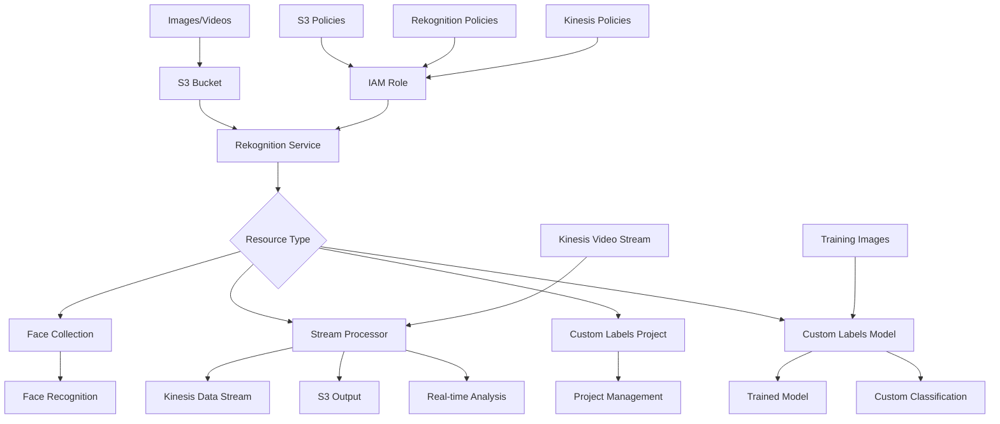

# AWS Rekognition Terraform Module

A comprehensive Terraform module for creating and configuring AWS Rekognition resources including Collections, Stream Processors, Projects, and Custom Labels Models with automatic IAM role management, S3 integration, and enterprise-ready configurations.

## Features

- **Face Collections**: Create and manage face recognition collections
- **Stream Processors**: Real-time video analysis with Kinesis integration
- **Custom Labels Projects**: Build custom image classification models
- **Custom Labels Models**: Train and deploy specialized image recognition models
- **IAM Management**: Automatic role creation with least-privilege permissions
- **S3 Integration**: Seamless integration with S3 for images and results
- **Kinesis Integration**: Real-time video stream processing
- **Flexible Configuration**: Support for both new and existing IAM roles
- **Security Best Practices**: Server-side encryption requirements and secure policies
- **Resource Tagging**: Consistent resource organization and cost tracking
- **Production Ready**: Lifecycle management and dependency handling

## Architecture



## Prerequisites

- Terraform >= 1.5.0
- AWS Provider >= 5.0
- Existing S3 bucket for images/videos (for collections and custom labels)
- Kinesis Video Stream (for stream processors)
- Valid IAM permissions for Rekognition service
- Images in supported formats (JPEG, PNG)
- Training data for custom labels models (if applicable)

## Quick Start

### Face Collection

```hcl
module "face_collection" {
  source = "./modules/rekognition"

  name          = "employee-faces"
  resource_type = "collection"
  
  tags = {
    Environment = "production"
    UseCase     = "access-control"
  }
}
```

### Stream Processor for Face Search

```hcl
module "video_face_search" {
  source = "./modules/rekognition"

  name          = "security-camera-processor"
  resource_type = "stream_processor"
  
  kinesis_video_stream_arn = "arn:aws:kinesisvideo:us-east-1:123456789012:stream/security-cameras"
  kinesis_data_stream_arn  = "arn:aws:kinesis:us-east-1:123456789012:stream/rekognition-results"
  
  settings = {
    face_search = {
      collection_id        = "employee-faces"
      face_match_threshold = 85.0
    }
  }
  
  s3_destination = {
    bucket     = "rekognition-results"
    key_prefix = "stream-output/"
  }
  
  tags = {
    Environment = "production"
    UseCase     = "security-monitoring"
  }
}
```

### Custom Labels Project

```hcl
module "custom_labels_project" {
  source = "./modules/rekognition"

  name          = "product-classification"
  resource_type = "project"
  
  project_name        = "product-classifier"
  project_description = "Custom labels project for product classification"
  
  tags = {
    Environment = "production"
    UseCase     = "inventory-management"
  }
}
```

### Custom Labels Model

```hcl
module "custom_labels_model" {
  source = "./modules/rekognition"

  name          = "product-classifier-model"
  resource_type = "custom_labels_model"
  
  custom_labels_model_name = "product-v1"
  project_arn              = "arn:aws:rekognition:us-east-1:123456789012:project/product-classifier"
  
  training_data_config = {
    assets = [
      {
        ground_truth_manifest = {
          s3_object = {
            bucket = "training-data"
            name   = "manifests/training-manifest.json"
          }
        }
      }
    ]
    s3_bucket = "training-data"
  }
  
  testing_data_config = {
    auto_create = true
  }
  
  output_config = {
    s3_bucket    = "model-output"
    s3_key_prefix = "models/"
  }
  
  s3_bucket_name = "training-data"
  
  tags = {
    Environment = "production"
    UseCase     = "product-classification"
  }
}
```

## Input Variables

### Required Variables

| Variable | Type | Description |
|----------|------|-------------|
| `name` | `string` | Name for the Rekognition resource |
| `resource_type` | `string` | Type of resource: `collection`, `stream_processor`, `project`, or `custom_labels_model` |

### Optional Variables

#### General Configuration

| Variable | Type | Default | Description |
|----------|------|---------|-------------|
| `existing_role_arn` | `string` | `null` | Use existing IAM role instead of creating new |
| `s3_bucket_name` | `string` | `null` | S3 bucket name for input images/videos |
| `s3_key_prefix` | `string` | `""` | S3 key prefix for organizing data |
| `tags` | `map(string)` | `{}` | Resource tags |
| `kms_key_id` | `string` | `null` | KMS key ID for encryption |

#### Collection Configuration (when `resource_type = "collection"`)

| Variable | Type | Default | Description |
|----------|------|---------|-------------|
| `collection_id` | `string` | `null` | ID for the face collection (defaults to name) |

#### Stream Processor Configuration (when `resource_type = "stream_processor"`)

| Variable | Type | Default | Description |
|----------|------|---------|-------------|
| `kinesis_video_stream_arn` | `string` | `null` | ARN of the Kinesis Video Stream |
| `kinesis_data_stream_arn` | `string` | `null` | ARN of the Kinesis Data Stream for output |
| `s3_destination` | `object` | `null` | S3 destination configuration |
| `settings` | `object` | `null` | Settings for stream processor (face search, etc.) |

#### Project Configuration (when `resource_type = "project"`)

| Variable | Type | Default | Description |
|----------|------|---------|-------------|
| `project_name` | `string` | `null` | Name of the project (defaults to name) |
| `project_description` | `string` | `""` | Description of the project |

#### Custom Labels Model Configuration (when `resource_type = "custom_labels_model"`)

| Variable | Type | Default | Description |
|----------|------|---------|-------------|
| `custom_labels_model_name` | `string` | `null` | Name of the custom labels model |
| `training_data_config` | `object` | `null` | Training data configuration |
| `testing_data_config` | `object` | `null` | Testing data configuration |
| `output_config` | `object` | `null` | Output configuration for model artifacts |

## Outputs

| Output | Description |
|--------|-------------|
| `collection_id` | ID of the collection (if created) |
| `collection_arn` | ARN of the collection (if created) |
| `stream_processor_id` | ID of the stream processor (if created) |
| `stream_processor_arn` | ARN of the stream processor (if created) |
| `stream_processor_status` | Status of the stream processor (if created) |
| `project_id` | ID of the project (if created) |
| `project_arn` | ARN of the project (if created) |
| `custom_labels_model_arn` | ARN of the custom labels model (if created) |
| `custom_labels_model_status` | Status of the custom labels model (if created) |
| `iam_role_arn` | ARN of the IAM role used by Rekognition |
| `iam_role_name` | Name of the IAM role created (if created by module) |

## Usage Examples

### Security Access Control with Face Recognition

```hcl
# Create face collection
module "access_control_collection" {
  source = "./modules/rekognition"

  name          = "authorized-personnel"
  resource_type = "collection"
  
  tags = {
    Environment = "production"
    UseCase     = "access-control"
    Department  = "security"
  }
}

# Stream processor for real-time face matching
module "entrance_camera_processor" {
  source = "./modules/rekognition"

  name          = "main-entrance-processor"
  resource_type = "stream_processor"
  
  kinesis_video_stream_arn = "arn:aws:kinesisvideo:us-east-1:123456789012:stream/entrance-camera"
  kinesis_data_stream_arn  = "arn:aws:kinesis:us-east-1:123456789012:stream/access-events"
  
  settings = {
    face_search = {
      collection_id        = module.access_control_collection.collection_id
      face_match_threshold = 90.0
    }
  }
  
  s3_destination = {
    bucket     = "access-logs"
    key_prefix = "face-matches/"
  }
  
  tags = {
    Environment = "production"
    UseCase     = "access-control"
  }
}
```

### Product Classification with Custom Labels

```hcl
# Create project
module "product_classification_project" {
  source = "./modules/rekognition"

  name          = "product-classifier-project"
  resource_type = "project"
  
  project_name        = "product-classifier"
  project_description = "Classify products by category and type"
  
  tags = {
    Environment = "production"
    UseCase     = "inventory"
  }
}

# Train custom labels model
module "product_classifier_model" {
  source = "./modules/rekognition"

  name          = "product-classifier-v1"
  resource_type = "custom_labels_model"
  
  custom_labels_model_name = "product-v1"
  project_arn              = module.product_classification_project.project_arn
  
  training_data_config = {
    assets = [
      {
        ground_truth_manifest = {
          s3_object = {
            bucket = "ml-training-data"
            name   = "manifests/product-training.json"
          }
        }
      }
    ]
    s3_bucket = "ml-training-data"
  }
  
  testing_data_config = {
    auto_create = true
  }
  
  output_config = {
    s3_bucket    = "model-artifacts"
    s3_key_prefix = "product-classifier/"
  }
  
  s3_bucket_name = "ml-training-data"
  
  tags = {
    Environment = "production"
    UseCase     = "product-classification"
    Version     = "v1"
  }
}
```

### Real-time Video Analysis

```hcl
module "video_analytics_processor" {
  source = "./modules/rekognition"

  name          = "store-analytics"
  resource_type = "stream_processor"
  
  kinesis_video_stream_arn = "arn:aws:kinesisvideo:us-east-1:123456789012:stream/store-cameras"
  kinesis_data_stream_arn  = "arn:aws:kinesis:us-east-1:123456789012:stream/analytics-events"
  
  settings = {
    face_search = {
      collection_id        = "customer-database"
      face_match_threshold = 75.0
    }
  }
  
  s3_destination = {
    bucket     = "analytics-results"
    key_prefix = "video-analysis/"
  }
  
  tags = {
    Environment = "production"
    UseCase     = "customer-analytics"
  }
}
```

## Security Best Practices

### IAM Roles and Policies

The module automatically creates IAM roles with least-privilege permissions:

- **S3 Access**: Read access to input buckets, write access to output buckets
- **Rekognition Service**: Permissions to use Rekognition services
- **Kinesis Access**: Read from video streams, write to data streams (for stream processors)
- **Encryption**: Enforces server-side encryption (AES256) for S3 operations

### Data Protection

- **Encryption at Rest**: Support for KMS encryption keys
- **Encryption in Transit**: All data transmission uses TLS/SSL
- **S3 Server-Side Encryption**: Required for all S3 output operations
- **Access Control**: Least-privilege IAM policies

### Privacy Considerations

- **Face Recognition**: Ensure compliance with privacy regulations
- **Data Retention**: Implement lifecycle policies for stored images
- **Access Logging**: Enable CloudTrail and S3 access logging
- **Consent Management**: Document and manage user consent for face recognition

## Cost Considerations

### Rekognition Pricing

- **Face Detection**: $1.00 per 1,000 images
- **Face Comparison**: $1.00 per 1,000 images
- **Face Search**: $1.00 per 1,000 images searched
- **Custom Labels Training**: $4.00 per training hour
- **Custom Labels Inference**: $4.00 per 1,000 images
- **Stream Processor**: $0.10 per video minute processed

### Cost Optimization Tips

- Use consistent tagging for cost allocation
- Monitor usage with CloudWatch metrics
- Implement image compression before processing
- Use batch processing for large image sets
- Clean up unused collections and models
- Optimize stream processor settings for cost

## Troubleshooting

### Common Issues

#### Collection Creation Fails
- **Issue**: Collection creation fails with permission errors
- **Solution**: Verify IAM role has proper Rekognition permissions
- **Check**: Ensure Rekognition service has access to create collections

#### Stream Processor Not Processing
- **Issue**: Stream processor not receiving video data
- **Solution**: Verify Kinesis Video Stream is active and accessible
- **Check**: Ensure IAM role has kinesisvideo:GetMedia permissions

#### Custom Labels Training Fails
- **Issue**: Training job fails with data errors
- **Solution**: Verify training manifest format and S3 permissions
- **Check**: Ensure training images are accessible and properly formatted

#### S3 Access Denied
- **Issue**: Rekognition cannot access S3 images
- **Solution**: Verify S3 bucket policies allow Rekognition service access
- **Check**: Ensure IAM role has s3:GetObject permissions

## Related Resources

- [AWS Rekognition Documentation](https://docs.aws.amazon.com/rekognition/)
- [Rekognition Face Recognition Guide](https://docs.aws.amazon.com/rekognition/latest/dg/faces.html)
- [Rekognition Custom Labels Guide](https://docs.aws.amazon.com/rekognition/latest/customlabels-dg/)
- [Rekognition Stream Processor Guide](https://docs.aws.amazon.com/rekognition/latest/dg/streaming-video.html)
- [Rekognition Pricing](https://aws.amazon.com/rekognition/pricing/)
- [Terraform AWS Provider - Rekognition](https://registry.terraform.io/providers/hashicorp/aws/latest/docs/resources/rekognition_collection)

---

**Version**: 1.0.0  
**Last Updated**: 2025  
**Terraform Version**: >= 1.5.0  
**AWS Provider Version**: >= 5.0

