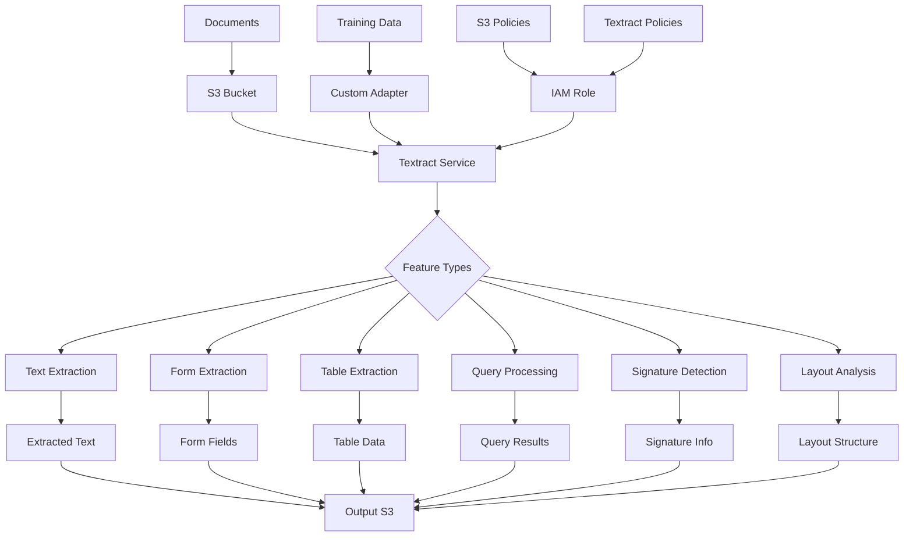

# AWS Textract Terraform Module

A comprehensive Terraform module for creating and configuring AWS Textract resources including Custom Adapters with automatic IAM role management, S3 integration, and enterprise-ready configurations.

## Features

- ✅ **Custom Adapters**: Create custom document processing adapters for specialized use cases
- 📄 **Document Analysis**: Extract text, forms, tables, and structured data from documents
- 🔐 **IAM Management**: Automatic role creation with least-privilege permissions
- 📁 **S3 Integration**: Seamless integration with S3 for input documents and output results
- 🎯 **Flexible Configuration**: Support for both new and existing IAM roles
- 🔒 **Security Best Practices**: Server-side encryption requirements and secure policies
- 🏷️ **Resource Tagging**: Consistent resource organization and cost tracking
- ⚡ **Production Ready**: Lifecycle management and dependency handling
- 📊 **Feature Types**: Support for TABLES, FORMS, QUERIES, SIGNATURES, and LAYOUT

## Architecture



## Prerequisites

- Terraform >= 1.5.0
- AWS Provider >= 5.0
- Existing S3 bucket for input documents
- Valid IAM permissions for Textract service
- Documents in supported formats (PDF, PNG, JPEG, TIFF)
- Training data manifest for custom adapters (if applicable)

## Quick Start

### Basic Adapter Configuration

```hcl
module "textract_adapter" {
  source = "./modules/textract"

  # Resource Configuration
  name          = "invoice-adapter"
  resource_type = "adapter"
  
  description = "Custom adapter for invoice processing"
  auto_update = true
  
  # S3 Configuration
  s3_bucket_name       = "textract-documents"
  s3_output_bucket_name = "textract-results"
  
  # Adapter Versions
  adapter_versions = [
    {
      version_name = "v1"
      dataset_config = {
        manifest_s3_object = {
          bucket = "textract-training-data"
          name   = "manifests/invoice-manifest.json"
        }
      }
    }
  ]
  
  tags = {
    Environment = "production"
    UseCase     = "invoice-processing"
  }
}
```

### Adapter with Multiple Versions

```hcl
module "multi_version_adapter" {
  source = "./modules/textract"

  name          = "document-adapter"
  resource_type = "adapter"
  
  description = "Multi-version adapter for document processing"
  auto_update = false
  
  s3_bucket_name = "document-bucket"
  
  adapter_versions = [
    {
      version_name = "v1"
      dataset_config = {
        manifest_s3_object = {
          bucket = "training-data"
          name   = "manifests/v1-manifest.json"
        }
      }
    },
    {
      version_name = "v2"
      dataset_config = {
        manifest_s3_object = {
          bucket = "training-data"
          name   = "manifests/v2-manifest.json"
        }
      }
    }
  ]
  
  tags = {
    Environment = "production"
    UseCase     = "document-processing"
  }
}
```

### Using Existing IAM Role

```hcl
module "textract_with_existing_role" {
  source = "./modules/textract"

  name          = "textract-adapter"
  resource_type = "adapter"
  
  existing_role_arn = "arn:aws:iam::123456789012:role/existing-textract-role"
  
  adapter_versions = [
    {
      version_name = "v1"
      dataset_config = {
        manifest_s3_object = {
          bucket = "training-bucket"
          name   = "manifests/manifest.json"
        }
      }
    }
  ]
  
  tags = {
    Environment = "production"
  }
}
```

## Input Variables

### Required Variables

| Variable | Type | Description |
|----------|------|-------------|
| `name` | `string` | Name for the Textract resource |
| `resource_type` | `string` | Type of resource: `adapter` |

### Optional Variables

#### General Configuration

| Variable | Type | Default | Description |
|----------|------|---------|-------------|
| `existing_role_arn` | `string` | `null` | Use existing IAM role instead of creating new |
| `s3_bucket_name` | `string` | `null` | S3 bucket name for input documents |
| `s3_key_prefix` | `string` | `""` | S3 key prefix for organizing input documents |
| `s3_output_bucket_name` | `string` | `null` | S3 bucket name for output results (defaults to input bucket) |
| `s3_output_key_prefix` | `string` | `""` | S3 key prefix for output results |
| `tags` | `map(string)` | `{}` | Resource tags |
| `kms_key_id` | `string` | `null` | KMS key ID for encryption |

#### Adapter Configuration

| Variable | Type | Default | Description |
|----------|------|---------|-------------|
| `adapter_name` | `string` | `null` | Name of the adapter (defaults to `name`) |
| `description` | `string` | `""` | Description of the adapter |
| `auto_update` | `bool` | `false` | Whether to automatically update the adapter |
| `adapter_versions` | `list(object)` | `[]` | List of adapter versions to create |

#### Adapter Version Object Structure

```hcl
{
  version_name = string
  dataset_config = {
    manifest_s3_object = {
      bucket = string
      name   = string
    }
  }
}
```

#### Feature Types Configuration

| Variable | Type | Default | Description |
|----------|------|---------|-------------|
| `feature_types` | `list(string)` | `["TABLES", "FORMS"]` | Feature types to enable: TABLES, FORMS, QUERIES, SIGNATURES, LAYOUT |

## Outputs

| Output | Description |
|--------|-------------|
| `adapter_id` | ID of the adapter (if created) |
| `adapter_arn` | ARN of the adapter (if created) |
| `adapter_name` | Name of the adapter (if created) |
| `iam_role_arn` | ARN of the IAM role used by Textract |
| `iam_role_name` | Name of the IAM role created (if created by module) |
| `s3_input_policy_arn` | ARN of the S3 input policy (if created) |
| `s3_output_policy_arn` | ARN of the S3 output policy (if created) |

## Usage Examples

### Invoice Processing Adapter

```hcl
module "invoice_adapter" {
  source = "./modules/textract"

  name          = "invoice-processing-adapter"
  resource_type = "adapter"
  
  description = "Custom adapter for extracting data from invoices"
  auto_update  = true
  
  s3_bucket_name        = "invoices-input"
  s3_output_bucket_name = "invoices-extracted"
  s3_output_key_prefix  = "results/"
  
  adapter_versions = [
    {
      version_name = "production-v1"
      dataset_config = {
        manifest_s3_object = {
          bucket = "textract-training"
          name   = "manifests/invoice-manifest.json"
        }
      }
    }
  ]
  
  feature_types = ["TABLES", "FORMS", "QUERIES"]
  
  tags = {
    Environment = "production"
    Team        = "finance"
    UseCase     = "invoice-processing"
  }
}
```

### Legal Document Adapter

```hcl
module "legal_document_adapter" {
  source = "./modules/textract"

  name          = "legal-document-adapter"
  resource_type = "adapter"
  
  description = "Adapter for processing legal documents with signature detection"
  auto_update  = false
  
  s3_bucket_name = "legal-documents"
  
  adapter_versions = [
    {
      version_name = "v1"
      dataset_config = {
        manifest_s3_object = {
          bucket = "legal-training-data"
          name   = "manifests/legal-v1.json"
        }
      }
    }
  ]
  
  feature_types = ["FORMS", "SIGNATURES", "LAYOUT"]
  
  kms_key_id = "arn:aws:kms:us-east-1:123456789012:key/abc123"
  
  tags = {
    Environment = "production"
    Team        = "legal"
    UseCase     = "contract-processing"
    DataClass   = "confidential"
  }
}
```

### Multi-Version Adapter with Rollback Support

```hcl
module "versioned_adapter" {
  source = "./modules/textract"

  name          = "versioned-document-adapter"
  resource_type = "adapter"
  
  description = "Adapter with multiple versions for A/B testing"
  auto_update  = false
  
  s3_bucket_name = "documents-bucket"
  
  adapter_versions = [
    {
      version_name = "stable-v1"
      dataset_config = {
        manifest_s3_object = {
          bucket = "training-data"
          name   = "manifests/stable-v1.json"
        }
      }
    },
    {
      version_name = "experimental-v2"
      dataset_config = {
        manifest_s3_object = {
          bucket = "training-data"
          name   = "manifests/experimental-v2.json"
        }
      }
    }
  ]
  
  feature_types = ["TABLES", "FORMS", "QUERIES", "LAYOUT"]
  
  tags = {
    Environment = "production"
    UseCase     = "document-processing"
    Versioning  = "enabled"
  }
}
```

## Security Best Practices

### IAM Roles and Policies

The module automatically creates IAM roles with least-privilege permissions:

- **S3 Input Access**: Read access to input document buckets
- **S3 Output Access**: Write access to output result buckets with encryption requirement
- **Textract Service**: Permissions to use Textract services
- **Encryption**: Enforces server-side encryption (AES256) for S3 operations

### Data Protection

- **Encryption at Rest**: Support for KMS encryption keys
- **Encryption in Transit**: All data transmission uses TLS/SSL
- **S3 Server-Side Encryption**: Required for all S3 output operations
- **Access Control**: Least-privilege IAM policies

### Document Security

- **Sensitive Data**: Tag resources according to data sensitivity
- **Access Logging**: Enable S3 access logging for audit trails
- **Lifecycle Policies**: Implement lifecycle policies for temporary documents

## Cost Considerations

### Textract Pricing
- **Synchronous API**: $1.50 per 1,000 pages (first 1M pages/month)
- **Asynchronous API**: $0.15 per 1,000 pages (first 1M pages/month)
- **Adapter Training**: Varies based on training data size
- **Storage**: S3 storage costs for input documents and output results

### Feature Type Costs
- **Basic Text**: Included in base pricing
- **Forms & Tables**: Included in base pricing
- **Queries**: Additional cost per query
- **Signatures**: Additional cost per page
- **Layout**: Additional cost per page

### Cost Optimization Tips
- 🏷️ Use consistent tagging for cost allocation
- 📊 Monitor usage with CloudWatch metrics
- 🔄 Use asynchronous API for batch processing
- 📈 Implement document lifecycle policies
- 🎯 Choose appropriate feature types (only enable what you need)
- 💾 Compress documents before processing when possible

## Document Processing Workflow

### Using the Adapter with AWS SDK

After creating the adapter, you can use it in your application:

```python
import boto3

textract = boto3.client('textract')

# Start document analysis with custom adapter
response = textract.start_document_analysis(
    DocumentLocation={
        'S3Object': {
            'Bucket': 'input-bucket',
            'Name': 'document.pdf'
        }
    },
    FeatureTypes=['TABLES', 'FORMS'],
    AdaptersConfig={
        'Adapters': [
            {
                'AdapterId': 'your-adapter-id',
                'AdapterVersion': 'v1',
                'Pages': ['1', '2']
            }
        ]
    },
    OutputConfig={
        'S3Bucket': 'output-bucket',
        'S3Prefix': 'results/'
    }
)
```

## Troubleshooting

### Common Issues

#### Adapter Creation Fails
- **Issue**: Adapter creation fails with permission errors
- **Solution**: Verify IAM role has proper S3 and Textract permissions
- **Check**: Ensure training manifest file exists and is accessible

#### S3 Access Denied
- **Issue**: Textract cannot access S3 documents
- **Solution**: Verify S3 bucket policies allow Textract service access
- **Check**: Ensure IAM role has s3:GetObject and s3:ListBucket permissions

#### Output Not Written to S3
- **Issue**: Results not appearing in output bucket
- **Solution**: Verify output bucket permissions and encryption settings
- **Check**: Ensure IAM role has s3:PutObject permission with encryption requirement

#### Adapter Version Issues
- **Issue**: Adapter version not found
- **Solution**: Verify version name matches exactly and manifest file is valid
- **Check**: Ensure manifest file follows Textract manifest format

## Best Practices

### Adapter Management
- ✅ **Version Control**: Use semantic versioning for adapter versions
- ✅ **Testing**: Test adapters with sample documents before production
- ✅ **Documentation**: Document adapter purpose and training data sources
- ✅ **Monitoring**: Monitor adapter performance and accuracy

### Document Processing
- ✅ **Format Validation**: Validate document formats before processing
- ✅ **Batch Processing**: Use asynchronous API for large document sets
- ✅ **Error Handling**: Implement retry logic for transient failures
- ✅ **Result Validation**: Validate extracted data before downstream processing

### Security
- ✅ **Encryption**: Always enable encryption for sensitive documents
- ✅ **Access Control**: Use least-privilege IAM policies
- ✅ **Data Classification**: Tag documents according to sensitivity
- ✅ **Audit Logging**: Enable CloudTrail and S3 access logging

### Performance
- ✅ **Feature Selection**: Only enable required feature types
- ✅ **Document Optimization**: Optimize document size and quality
- ✅ **Async Processing**: Use async API for better throughput
- ✅ **Caching**: Cache results for frequently accessed documents

## Related Resources

- [AWS Textract Documentation](https://docs.aws.amazon.com/textract/)
- [Textract Custom Adapters Guide](https://docs.aws.amazon.com/textract/latest/dg/custom-adapter.html)
- [Textract API Reference](https://docs.aws.amazon.com/textract/latest/dg/API_Reference.html)
- [Textract Pricing](https://aws.amazon.com/textract/pricing/)
- [Terraform AWS Provider - Textract](https://registry.terraform.io/providers/hashicorp/aws/latest/docs/resources/textract_adapter)

---

**Version**: 1.0.0  
**Last Updated**: 2025  
**Terraform Version**: >= 1.5.0  
**AWS Provider Version**: >= 5.0


